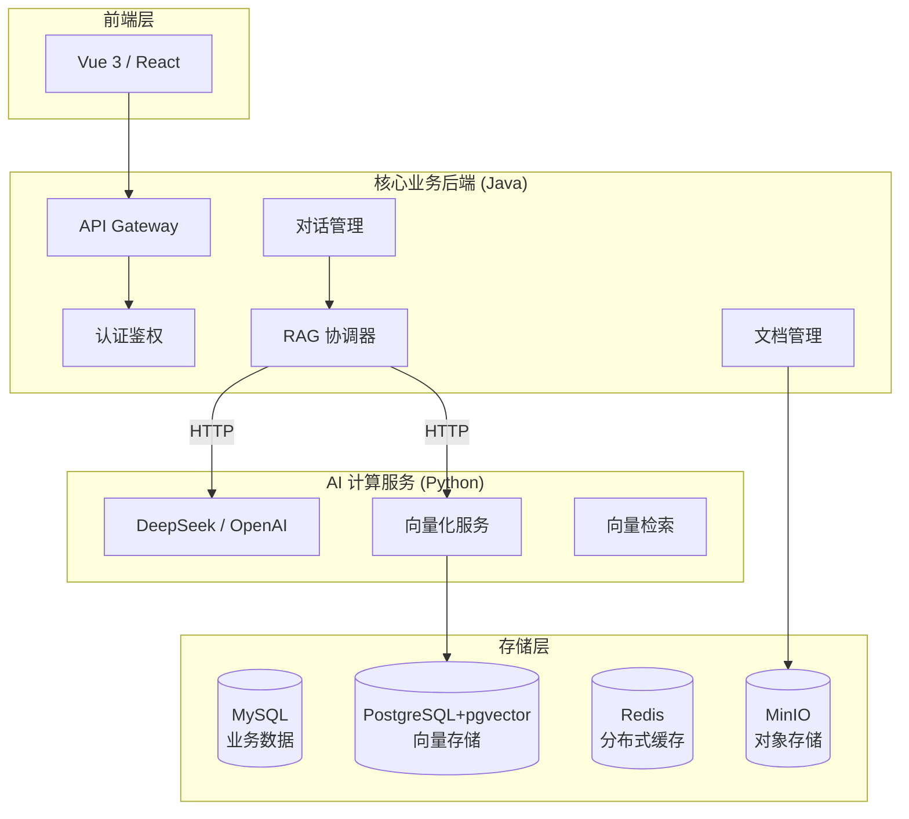

# LLM-Research-Assistant - 基于大模型的文章编研系统

[](https://www.oracle.com/java/)
[](https://spring.io/projects/spring-boot)
[](https://www.python.org/)
[](https://fastapi.tiangolo.com/)
[](LICENSE)

## 🌟 项目简介

**LLM-Research-Assistant** 是一个专为学术研究和文章编研设计的智能化辅助系统。它结合了现代 Java 后端的稳健架构与 Python AI 服务的灵活性，通过 RAG（检索增强生成）技术，实现对海量本地文档的精准检索与智能化对话。

本项目不仅是一个功能完备的毕设项目，更是在架构设计上深度结合了 **计算机考研 408 基础知识**（操作系统、计算机网络、数据结构、数据库），旨在展示扎实的工程化能力与理论基础。

---

## 🏗️ 系统架构

系统采用 **双服务异步架构**，实现业务逻辑与 AI 计算的解耦。



---

## 🛠️ 技术栈

### 后端 (Java)
*   **核心框架**: Spring Boot 3.2.x
*   **权限安全**: Spring Security + JWT
*   **数据持久化**: MyBatis-Plus
*   **并发编程**: CompletableFuture + 自定义线程池 (JUC)
*   **辅助工具**: Lombok, Hutool, OkHttp

### AI 服务 (Python)
*   **核心框架**: FastAPI
*   **RAG 引擎**: LlamaIndex
*   **大模型**: DeepSeek (OpenAI 兼容协议)
*   **日志/配置**: Loguru, Pydantic Settings

### 基础设施
*   **数据库**: MySQL 8.0
*   **向量库**: PostgreSQL 16 + pgvector
*   **缓存**: Redis 7.0
*   **部署**: Docker Compose

---

## ✨ 核心亮点 (408 考点结合)

*   **操作系统 - 并发管理**: 针对 AI 接口响应慢的特点，自定义 **ThreadPoolExecutor**，根据 I/O 密集型任务优化核心线程数与队列策略。
*   **数据结构 - 向量检索**: 深入理解 **HNSW (Hierarchical Navigable Small World)** 算法原理，实现高效的高维向量相似度检索。
*   **计算机网络 - 流式传输**: 利用 **SSE (Server-Sent Events)** 实现大模型的流式 Token 返回，优化用户交互体验。
*   **设计模式 - 代理模式**: 通过 **Spring AOP** 实现非侵入式的 API 操作审计日志，体现面向切面编程思想。
*   **分布式同步**: 使用 Redis 实现分布式锁，确保文档向量化任务的原子性与一致性。

---

## 🚀 快速开始

### 1. 环境准备
确保已安装：
*   Docker & Docker Compose
*   JDK 17+
*   Python 3.10+
*   Git

### 2. 启动基础设施
```bash
docker-compose up -d
```
> [!NOTE]
> 默认映射端口：MySQL (3307), Redis (6379), PostgreSQL (5432), MinIO (9000/9001)。

### 3. 下一步计划
详细开发进度请参考 [docs/task.md](docs/task.md) 和 [docs/implementation_plan.md](docs/implementation_plan.md)。

---

## 📄 许可证

本项目遵循 [MIT License](LICENSE)。
