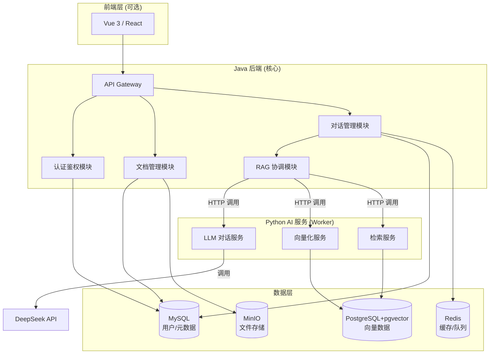
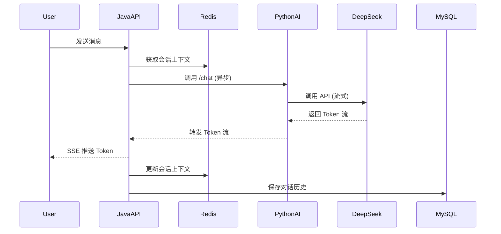

# LLM-Research-Assistant 项目实施计划

## 项目概述

**项目名称**: LLM-Research-Assistant - 基于大模型的文章编研系统  
**项目目标**: 
- 完成毕业设计要求
- 在考研复试中展示扎实的 Java 后端架构能力和 AI 工程化落地能力
- 体现 408 基础知识在实际项目中的应用

---

## 系统架构设计

### 整体架构



### 技术栈明细

#### Java 后端
- **框架**: Spring Boot 3.2.x + Java 17
- **ORM**: MyBatis-Plus 3.5.x
- **安全**: Spring Security + JWT
- **工具**: Lombok, Hutool, Guava
- **HTTP 客户端**: OkHttp 4.x
- **API 文档**: Knife4j (Swagger)
- **日志**: SLF4J + Logback

#### Python AI 服务
- **框架**: FastAPI 0.109.x + Python 3.10+
- **RAG**: LlamaIndex 0.9.x
- **LLM SDK**: OpenAI SDK (兼容 DeepSeek)
- **向量数据库**: pgvector
- **配置管理**: Pydantic Settings
- **日志**: Loguru

#### 数据库
- **MySQL 8.0**: 用户、文档元数据、对话历史
- **PostgreSQL 16 + pgvector**: 向量数据
- **Redis 7.0**: Token 缓存、会话缓存、任务队列

---

## 数据库设计

### MySQL 表结构

#### 用户表 (sys_user)
```sql
CREATE TABLE sys_user (
    id BIGINT PRIMARY KEY AUTO_INCREMENT COMMENT '用户ID',
    username VARCHAR(50) NOT NULL UNIQUE COMMENT '用户名',
    password VARCHAR(255) NOT NULL COMMENT '密码（BCrypt加密）',
    email VARCHAR(100) COMMENT '邮箱',
    nickname VARCHAR(50) COMMENT '昵称',
    avatar VARCHAR(255) COMMENT '头像URL',
    status TINYINT DEFAULT 1 COMMENT '状态：0-禁用，1-正常',
    create_time DATETIME DEFAULT CURRENT_TIMESTAMP COMMENT '创建时间',
    update_time DATETIME DEFAULT CURRENT_TIMESTAMP ON UPDATE CURRENT_TIMESTAMP COMMENT '更新时间',
    INDEX idx_username (username)
) ENGINE=InnoDB DEFAULT CHARSET=utf8mb4 COMMENT='用户表';
```

#### 文档表 (doc_document)
```sql
CREATE TABLE doc_document (
    id BIGINT PRIMARY KEY AUTO_INCREMENT COMMENT '文档ID',
    user_id BIGINT NOT NULL COMMENT '所属用户ID',
    title VARCHAR(255) NOT NULL COMMENT '文档标题',
    file_name VARCHAR(255) NOT NULL COMMENT '文件名',
    file_path VARCHAR(500) NOT NULL COMMENT '文件存储路径',
    file_size BIGINT COMMENT '文件大小（字节）',
    file_type VARCHAR(50) COMMENT '文件类型：pdf/txt/markdown',
    status TINYINT DEFAULT 0 COMMENT '状态：0-未处理，1-向量化中，2-已完成',
    create_time DATETIME DEFAULT CURRENT_TIMESTAMP COMMENT '创建时间',
    update_time DATETIME DEFAULT CURRENT_TIMESTAMP ON UPDATE CURRENT_TIMESTAMP COMMENT '更新时间',
    INDEX idx_user_id (user_id),
    INDEX idx_status (status)
) ENGINE=InnoDB DEFAULT CHARSET=utf8mb4 COMMENT='文档表';
```

#### 对话会话表 (chat_session)
```sql
CREATE TABLE chat_session (
    id BIGINT PRIMARY KEY AUTO_INCREMENT COMMENT '会话ID',
    user_id BIGINT NOT NULL COMMENT '用户ID',
    title VARCHAR(255) COMMENT '会话标题',
    create_time DATETIME DEFAULT CURRENT_TIMESTAMP COMMENT '创建时间',
    update_time DATETIME DEFAULT CURRENT_TIMESTAMP ON UPDATE CURRENT_TIMESTAMP COMMENT '更新时间',
    INDEX idx_user_id (user_id)
) ENGINE=InnoDB DEFAULT CHARSET=utf8mb4 COMMENT='对话会话表';
```

#### 对话消息表 (chat_message)
```sql
CREATE TABLE chat_message (
    id BIGINT PRIMARY KEY AUTO_INCREMENT COMMENT '消息ID',
    session_id BIGINT NOT NULL COMMENT '会话ID',
    role VARCHAR(20) NOT NULL COMMENT '角色：user/assistant',
    content TEXT NOT NULL COMMENT '消息内容',
    token_count INT COMMENT 'Token 数量',
    create_time DATETIME DEFAULT CURRENT_TIMESTAMP COMMENT '创建时间',
    INDEX idx_session_id (session_id)
) ENGINE=InnoDB DEFAULT CHARSET=utf8mb4 COMMENT='对话消息表';
```

### PostgreSQL 向量表

```sql
-- 启用 pgvector 扩展
CREATE EXTENSION IF NOT EXISTS vector;

-- 文档向量表
CREATE TABLE doc_embeddings (
    id BIGSERIAL PRIMARY KEY,
    doc_id BIGINT NOT NULL,
    chunk_index INT NOT NULL,
    chunk_text TEXT NOT NULL,
    embedding vector(1536),  -- OpenAI embedding 维度
    create_time TIMESTAMP DEFAULT CURRENT_TIMESTAMP
);

-- 创建向量索引（HNSW 算法，面试加分项）
CREATE INDEX ON doc_embeddings USING hnsw (embedding vector_cosine_ops);
```

---

## 核心功能模块设计

### 1. 用户认证模块（对应考点：网络安全、加密算法）

#### 技术方案
- **密码加密**: BCrypt（对应考点：哈希算法、加盐）
- **Token 机制**: JWT（对应考点：数字签名、对称/非对称加密）
- **Token 存储**: Redis（对应考点：缓存策略、过期机制）

#### 接口设计
- `POST /api/auth/register` - 用户注册
- `POST /api/auth/login` - 用户登录
- `POST /api/auth/logout` - 用户登出
- `GET /api/auth/info` - 获取当前用户信息

#### 面试亮点
- JWT Token 双 Token 机制（Access Token + Refresh Token）
- Redis 实现 Token 黑名单（防止已登出 Token 被重用）
- 登录失败次数限制（防暴力破解）

---

### 2. 文档管理模块（对应考点：文件系统、I/O）

#### 技术方案
- **文件存储**: MinIO（对象存储）或本地文件系统
- **文件上传**: MultipartFile + 流式处理
- **文件类型校验**: Magic Number 检测（不仅依赖扩展名）

#### 接口设计
- `POST /api/doc/upload` - 上传文档
- `GET /api/doc/list` - 文档列表（分页）
- `DELETE /api/doc/{id}` - 删除文档
- `GET /api/doc/{id}/download` - 下载文档

#### 面试亮点
- 大文件分片上传（前端分片 + 后端合并）
- 文件上传进度反馈（WebSocket）
- 异步向量化任务（上传后立即返回，后台处理）

---

### 3. AI 对话模块（核心业务）

#### 技术方案
- **实时通信**: SSE（Server-Sent Events）或 WebSocket
- **异步调用**: CompletableFuture + 自定义线程池
- **超时控制**: Resilience4j 或自定义超时机制
- **流式响应**: 逐 Token 返回（提升用户体验）

#### 接口设计
- `POST /api/chat/session` - 创建会话
- `POST /api/chat/send` - 发送消息（SSE 流式返回）
- `GET /api/chat/history/{sessionId}` - 获取历史消息

#### 核心流程


#### 面试亮点
- **线程池设计**（对应考点：操作系统-进程与线程）
  - 核心线程数 = CPU 核心数
  - 最大线程数 = CPU 核心数 * 2
  - 队列类型：LinkedBlockingQueue（有界队列，防止 OOM）
  - 拒绝策略：CallerRunsPolicy（降级到主线程执行）
  
- **超时与重试**（对应考点：计算机网络-可靠传输）
  - 连接超时：5s
  - 读取超时：30s
  - 重试策略：指数退避（1s, 2s, 4s）

---

### 4. RAG 检索增强模块（AI 核心）

#### 技术方案
- **文档分块**: LlamaIndex SimpleNodeParser
  - Chunk Size: 512 tokens
  - Overlap: 50 tokens（保证上下文连贯性）
  
- **Embedding 模型**: OpenAI text-embedding-ada-002
  - 维度: 1536
  - 成本: $0.0001 / 1K tokens
  
- **检索策略**: 向量相似度 + 关键词混合检索
  - Top-K: 3-5 个最相关片段
  - 相似度阈值: 0.7

#### 接口设计（Python 服务）
- `POST /embed` - 文档向量化
- `POST /search` - 向量检索
- `POST /chat` - RAG 增强对话

#### 面试亮点
- **向量检索原理**（对应考点：数据结构-KNN、HNSW 算法）
- **Embedding 缓存策略**（对应考点：缓存一致性）
- **检索结果重排序**（Rerank，提升准确率）

---

## 面试加分项设计

### 1. AOP 日志切面（对应考点：设计模式-代理模式）

```java
@Aspect
@Component
@Slf4j
public class ApiLogAspect {
    
    @Around("@annotation(apiLog)")
    public Object around(ProceedingJoinPoint point, ApiLog apiLog) throws Throwable {
        long startTime = System.currentTimeMillis();
        
        // 记录请求参数
        String className = point.getTarget().getClass().getName();
        String methodName = point.getSignature().getName();
        Object[] args = point.getArgs();
        
        log.info("[API请求] {}.{} 参数: {}", className, methodName, args);
        
        Object result;
        try {
            result = point.proceed();
            long costTime = System.currentTimeMillis() - startTime;
            log.info("[API响应] {}.{} 耗时: {}ms", className, methodName, costTime);
            return result;
        } catch (Exception e) {
            log.error("[API异常] {}.{} 异常: {}", className, methodName, e.getMessage());
            throw e;
        }
    }
}
```

**面试话术**: 
> "我使用 Spring AOP 实现了统一的日志切面，基于动态代理模式，在不侵入业务代码的情况下记录每个 API 的请求参数、响应结果和执行耗时。这对应了 408 中的**代理模式**和**面向切面编程**思想。"

---

### 2. 线程池配置（对应考点：操作系统-线程管理）

```java
@Configuration
public class ThreadPoolConfig {
    
    /**
     * AI 调用专用线程池
     * 核心线程数 = CPU 核心数（I/O 密集型任务）
     * 最大线程数 = CPU 核心数 * 2
     * 队列: LinkedBlockingQueue（有界队列，防止 OOM）
     * 拒绝策略: CallerRunsPolicy（降级到主线程）
     * 
     * 对应 408 考点：
     * - 操作系统：线程池原理、线程生命周期
     * - 数据结构：阻塞队列实现
     */
    @Bean("aiTaskExecutor")
    public ThreadPoolTaskExecutor aiTaskExecutor() {
        int corePoolSize = Runtime.getRuntime().availableProcessors();
        
        ThreadPoolTaskExecutor executor = new ThreadPoolTaskExecutor();
        executor.setCorePoolSize(corePoolSize);
        executor.setMaxPoolSize(corePoolSize * 2);
        executor.setQueueCapacity(100);
        executor.setThreadNamePrefix("ai-task-");
        executor.setRejectedExecutionHandler(new ThreadPoolExecutor.CallerRunsPolicy());
        executor.setWaitForTasksToCompleteOnShutdown(true);
        executor.setAwaitTerminationSeconds(60);
        executor.initialize();
        
        return executor;
    }
}
```

**面试话术**:
> "我针对 AI 调用场景设计了专用线程池。因为调用外部 API 是 I/O 密集型任务，所以核心线程数设置为 CPU 核心数，最大线程数为核心数的 2 倍。使用有界队列防止内存溢出，拒绝策略选择 CallerRunsPolicy 实现优雅降级。这体现了**操作系统中线程池的设计原理**。"

---

### 3. 分布式锁（对应考点：操作系统-进程同步）

```java
@Service
public class DocumentService {
    
    @Autowired
    private RedisTemplate<String, String> redisTemplate;
    
    /**
     * 文档向量化（防止重复处理）
     * 使用 Redis 分布式锁
     * 
     * 对应 408 考点：
     * - 操作系统：互斥锁、信号量
     * - 计算机网络：分布式系统一致性
     */
    public void vectorizeDocument(Long docId) {
        String lockKey = "doc:vectorize:" + docId;
        
        // 尝试获取锁（SET NX EX）
        Boolean locked = redisTemplate.opsForValue()
            .setIfAbsent(lockKey, "1", 5, TimeUnit.MINUTES);
        
        if (Boolean.FALSE.equals(locked)) {
            throw new BizException("文档正在处理中，请勿重复提交");
        }
        
        try {
            // 执行向量化逻辑
            doVectorize(docId);
        } finally {
            // 释放锁
            redisTemplate.delete(lockKey);
        }
    }
}
```

**面试话术**:
> "为了防止同一文档被重复向量化，我使用 Redis 实现了分布式锁。通过 `SET NX EX` 命令保证原子性，设置过期时间防止死锁。这对应了**操作系统中的互斥锁**和**分布式系统的一致性问题**。"

---

## 开发路线图

### 第 1 周：基础设施
- [x] Docker 环境搭建
- [ ] Java 项目初始化
- [ ] 数据库表结构设计与初始化
- [ ] Python 项目结构重构

### 第 2 周：Java 核心架构
- [ ] 统一响应封装、异常处理
- [ ] AOP 日志切面
- [ ] 线程池配置
- [ ] 用户认证模块（JWT）

### 第 3 周：文档管理 + AI 对话
- [ ] 文档上传/列表/删除接口
- [ ] Python LLM 对话服务
- [ ] Java 调用 Python 服务
- [ ] SSE 流式响应

### 第 4 周：RAG 检索
- [ ] Python 文档向量化服务
- [ ] 向量存储到 pgvector
- [ ] 向量检索接口
- [ ] RAG 增强对话

### 第 5 周：测试与优化
- [ ] 单元测试
- [ ] 接口测试
- [ ] 性能优化
- [ ] API 文档完善

### 第 6 周：复试准备
- [ ] 技术文档整理
- [ ] 架构图绘制
- [ ] 面试问答准备
- [ ] 演示视频录制

---

## 复试考点对应关系

| 功能模块 | 408 考点 | 面试话术 |
|---------|---------|---------|
| JWT 认证 | 计算机网络-数字签名、加密算法 | "使用 HMAC-SHA256 签名，保证 Token 不可篡改" |
| 线程池 | 操作系统-线程管理 | "根据 I/O 密集型任务特点设计线程池参数" |
| AOP 日志 | 设计模式-代理模式 | "基于动态代理实现横切关注点分离" |
| 分布式锁 | 操作系统-进程同步 | "使用 Redis SET NX 实现互斥锁" |
| 向量检索 | 数据结构-KNN、HNSW 算法 | "使用 HNSW 索引加速高维向量检索" |
| 异步调用 | 操作系统-并发编程 | "使用 CompletableFuture 实现非阻塞调用" |
| Redis 缓存 | 计算机组成-存储层次结构 | "热点数据缓存，减少数据库压力" |
| MyBatis-Plus | 数据库-SQL 优化 | "使用索引优化查询，避免全表扫描" |

---

## 下一步行动

> [!IMPORTANT]
> **当前优先级最高的任务**：
> 1. 创建 Java Spring Boot 项目骨架
> 2. 配置数据库连接（MySQL 3307 端口）
> 3. 初始化数据库表结构
> 4. 搭建基础架构层（统一响应、异常处理）

准备好开始了吗？我可以立即帮你：
- 生成 Spring Boot 项目结构
- 创建数据库初始化 SQL 脚本
- 实现基础架构代码（Result、GlobalExceptionHandler、AOP 日志）
